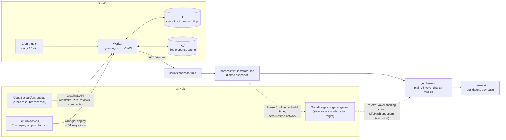

# Oogatron

A jumbotron for the voxel world. Oogatron collects contributor analytics from
[OogaBoogaX/entropylab](https://github.com/OogaBoogaX/entropylab), stores them
event-by-event in Cloudflare D1, serves them from a Cloudflare Worker, and
renders them on a voxel jumbotron screen built to sit inside
[OogaBoogaX/oogaboogaland](https://github.com/OogaBoogaX/oogaboogaland) — the
dependency-free WebGL2 floating-island world whose voxel cavemen already
represent entropylab contributors.

See [CLAUDE.md](CLAUDE.md) for the full project spec (the source of truth for
scope, schema, and conventions).

## Architecture



Three pieces, deliberately decoupled:

| Piece | What it is | Stack |
| --- | --- | --- |
| `worker/` | Data service: polls entropylab over the GitHub GraphQL API on a 10-minute cron, stores every commit / PR / review / comment as an individual event in D1, recomputes daily rollups, and serves a frozen, versioned JSON contract at `/v1/*` with KV caching | TypeScript on Cloudflare Workers + D1 + KV |
| `jumbotron/` | The display: parses the stats JSON, renders LED-board views (totals, per-type leaderboards, per-contributor cards with identicons and sparklines, a scrolling ticker) onto an offscreen canvas, and shows it on a flat-shaded voxel screen mesh | Plain JavaScript, zero dependencies, no build step |
| `harness/` | Standalone dev page: orbit camera, view controls, live-or-fixture data switching, and a Canvas-2D fallback (`?canvas2d=1`) | One static HTML file |

Design principles, from the spec:

- **Cron polling only** — no webhooks (they would need admin on entropylab).
  Ingestion is budget-metered and resumable, so a full history backfill
  completes across multiple Worker invocations within free-plan limits.
- **Event-level storage** — not counters — so any later filtering by
  contributor, type, or time window needs no schema change.
- **Snapshot-first integration** — the jumbotron module never fetches.
  Data is always pushed in via `update(statsJson)`; oogaboogaland will bake
  the snapshot in at build time and stay zero-network at runtime.
- **Bots are stored but excluded by default** (`?include_bots=1` overrides),
  and unmatched commit emails become salted-hash identities — raw emails are
  never stored.

## API

All responses are JSON with CORS enabled for GET, cached in KV for 60 seconds,
and carry `meta: { generated_at, repo, schema_version }`.

| Endpoint | Returns |
| --- | --- |
| `GET /v1/stats` | The everything-payload: totals, leaderboards, and the complete per-contributor breakdown with weekly buckets (this is also the snapshot format) |
| `GET /v1/contributors` | Roster with lifetime counts (no weekly detail) |
| `GET /v1/contributors/{login}` | One contributor, with `?from=`, `?to=`, `?type=` filters recomputed from raw events |
| `GET /v1/health` | Last sync run, cursors, and row counts |
| `POST /admin/backfill` | Bearer-token protected; runs one budget-bounded sync slice (loop until `done: true` to drive a full backfill) |

The contract is frozen at `schema_version: 1`; only additive changes are
allowed. `scripts/lib/validate-stats.mjs` is the dependency-free validator
shared by the test suite, the snapshot script, and the jumbotron's data layer,
so the fixture and the live API can never drift apart silently.

## Running locally

The jumbotron and harness are static files — any static server works:

```sh
python3 -m http.server 8765
# then open:
#   http://localhost:8765/harness/                 fixture data (offline)
#   http://localhost:8765/harness/?src=<worker>    live data from a deployed worker
#   http://localhost:8765/harness/?canvas2d=1      Canvas-2D fallback path
```

Worker development and tests (vitest running inside the real Workers runtime,
with recorded GraphQL fixtures — no network):

```sh
cd worker
npm install
npm test           # sync engine, rollups, API, contract tests
npm run typecheck
npm run dev        # local dev server via wrangler
```

Harness smoke test (headless Chrome, fails on any console error in either
render path):

```sh
npm install        # repo root
npm run smoke
```

## Deployment

One-time provisioning in a Cloudflare account (IDs go in
`worker/wrangler.toml`; they are not secrets):

```sh
cd worker
wrangler d1 create oogatron
wrangler kv namespace create CACHE
wrangler d1 migrations apply oogatron --remote
wrangler secret put GITHUB_TOKEN   # fine-grained PAT, public-repo read-only
wrangler secret put ADMIN_TOKEN    # e.g. openssl rand -hex 32
wrangler deploy
```

Then drive the initial backfill until it reports `done: true`:

```sh
curl -X POST -H "Authorization: Bearer $ADMIN_TOKEN" https://<your-worker>/admin/backfill
```

CI/CD runs entirely in GitHub Actions: `ci.yml` (typecheck, lint, tests,
harness smoke) on every PR and push to `rock`, and `deploy.yml` (D1 migrations
+ `wrangler deploy`) on push to `rock`, using the `CLOUDFLARE_API_TOKEN` and
`CLOUDFLARE_ACCOUNT_ID` repo secrets. Nothing is org-specific, so the repo can
transfer with only a secrets re-check.

## oogaboogaland integration

The jumbotron is built to be dropped into oogaboogaland as a prop
(spec "Phase 5", a separate effort against that repo):

- **Zero runtime network.** oogaboogaland's CSP and privacy promise forbid
  runtime requests, so the stats snapshot is inlined at build time by its
  build script; a scheduled workflow there re-bakes it periodically.
  `scripts/snapshot.mjs` produces exactly that artifact.
- **Engine-agnostic mesh.** The module takes a `WebGL2RenderingContext` and a
  view-projection matrix — it owns only its model transform — so it can be
  drawn by oogaboogaland's renderer directly, or re-meshed with the island's
  native `box()`/`BL.models.merge` builders during integration.
- **Interaction hook.** The per-contributor card view exists so that "poke an
  Ooga → the jumbotron shows their stats" becomes a one-call integration:
  `jumbotron.setView("contributor", { login })`.
- **Fallback parity.** The Canvas-2D display core mirrors oogaboogaland's
  `?canvas2d=1` degradation strategy.

To make it read as native, the visual style was extracted from a clone of the
oogaboogaland source rather than invented: the palette tokens in
`jumbotron/views.js` carry the island's actual material colors (wood, plank,
paper, its amber accent, the matrix-green and teal of its in-world lab
screens), the cabinet copies its crate's frame-to-panel proportions, per-face
shading uses the measured day ratios of its lighting model
(top : lit : dark : bottom ≈ 1.0 : 0.75 : 0.5 : 0.33), and contributor
identicons draw their colors from the same LifeHash spectrum its identicon
system uses.

## Sources & credits

- **Data:** the public activity of
  [OogaBoogaX/entropylab](https://github.com/OogaBoogaX/entropylab), ingested
  via the [GitHub GraphQL API](https://docs.github.com/en/graphql) (with the
  REST API used for count verification). Public contributor handles and public
  activity only — no private data of any kind.
- **Visual style:**
  [OogaBoogaX/oogaboogaland](https://github.com/OogaBoogaX/oogaboogaland) —
  palette values, voxel shading ratios, screen/cabinet proportions, and HUD
  language extracted from its source.
- **Identicon colors:** the color spectrum of
  [LifeHash](https://github.com/BlockchainCommons/bc-lifehash) by Blockchain
  Commons (BSD-2-Clause-Patent), which oogaboogaland ports for its in-world
  identicons.
- **Platform:** [Cloudflare Workers, D1, and KV](https://developers.cloudflare.com/workers/);
  deploys via [`cloudflare/wrangler-action`](https://github.com/cloudflare/wrangler-action).
